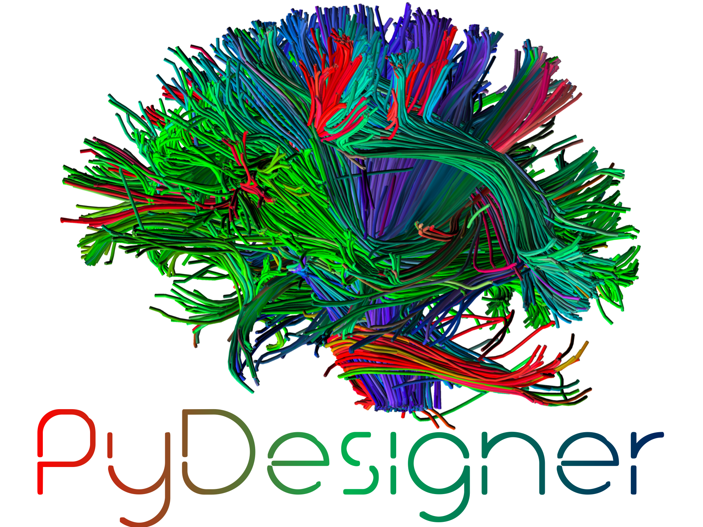

.. PyDesigner documentation master file, created by
   sphinx-quickstart on Tue Feb 18 15:48:53 2020.
   You can adapt this file completely to your liking, but it should at least
   contain the root `toctree` directive.

Welcome to the official PyDesigner documentation
================================================

.. image:: https://img.shields.io/docker/pulls/dmri/neurodock?style=flat-square
   :target: https://hub.docker.com/r/dmri/neurodock
   :alt: Docker Pulls

.. image:: https://img.shields.io/docker/cloud/automated/dmri/neurodock?style=flat-square
   :target: https://hub.docker.com/r/dmri/neurodock/builds
   :alt: Docker Cloud Automated build

.. image:: https://img.shields.io/docker/cloud/build/dmri/neurodock?style=flat-square
   :target: https://hub.docker.com/r/dmri/neurodock/builds
   :alt: Docker Cloud Build Status

.. image:: https://img.shields.io/github/v/release/m-ama/PyDesigner?include_prereleases&style=flat-square\
   :target: https://github.com/m-ama/PyDesigner/releases/latest
   :alt: GitHub release (latest SemVer including pre-releases)

.. image:: https://img.shields.io/github/downloads/m-ama/PyDesigner/total?style=flat-square
   :target: https://github.com/m-ama/PyDesigner/releases
   :alt: GitHub All Releases

PyDesigner was inspired by `NYU's DESIGNER`_ dMRI preprocessing pipeline
to bring pre- and post- processing to every MRI imaging scientist. With PyDesigner,
users are no longer confined to specific file types, operating systems,
or complicated scripts just to extract DTI or DKI parameters –
PyDesigner makes this easy, and you will love it!

.. _NYU's DESIGNER: https://github.com/NYU-DiffusionMRI/DESIGNER

Notable Features
================

- **100% Python-based** scripts
- **Minimized package dependencies** for small package footprint
- Preprocessing designed to **boost SNR**
- **Accurate and fast** DTI and DKI metrics via cutting-edge algorithms
- **One-shot** preprocessing to parameter extraction
- **Cross-platform compatibility** between Windows, Mac and Linux using Docker
- Highly flexible and **easy to use**
- **Easy install** with `pip`
- Input **file-format agnostic** – works with .nii, .nii.gz, .mif and dicoms
- **Quality control metrics** to evaluate data integrity – SNR graphs and outlier voxels
- Uses the **latest techniques** from DTI/DKI literature

We welcome all DTI/DKI researchers to evaluate this software and pass
on their feedback or issues through the `Issues`_ page of this
project’s GitHub repository. Additionally, you may join the `M-AMA
Slack channel`_ for live support.

.. _Issues: https://github.com/m-ama/PyDesigner/issues
.. _M-AMA Slack channel: https://join.slack.com/t/m-ama/shared_invite/enQtOTUyOTU0MTQ1OTQxLTQwOGZlMzI4YmY2YTUxOWY2NmYxMjgwM2E4ODdkNmU3MGYyMjFiMThlYTIwOGQyNzEzMTAzYTZmMmMyM2NjNTc

**System Requirements**
   Parallel processing in PyDesigner scales almost linearly with the
   nummber of CPU cores present. The application is also memory-intensive
   due to the number of parameter maps being computed.

   Based on this evaluation, for processing a single DWI using
   PyDesigner, we recommend the following minimum system specifications:

   - Ubuntu 18.04
   - Intel i7-9700 or AMD Ryzen 1800X [8 cores]
   - 16 GB RAM
   - 12 GB free storage
   - Nvidia CUDA-enabled GPU

.. toctree::
   :maxdepth: 1
   :caption: Installation

   installation/requirements
   installation/fsl
   installation/mrtrix3
   installation/python
   installation/pydesigner

.. toctree::
   :maxdepth: 1
   :caption: NeuroDock (Docker)

   docker/introduction
   docker/docker_install
   docker/docker_configuration
   docker/docker_neurodock
   docker/docker_neurodock_run

.. toctree::
   :maxdepth: 1
   :caption: Reference

   reference/pydesigner_args
   reference/pydesigner_files
   reference/acknowledgements
   reference/contributors

Indices and tables
==================

* :ref:`genindex`
* :ref:`modindex`
* :ref:`search`
